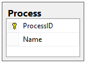
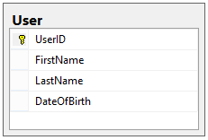
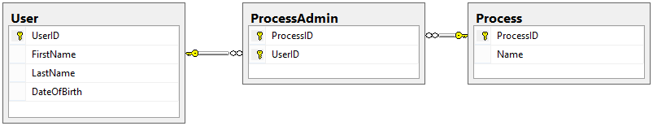

# Designing a Workflow Engine Database Part 2: The Process Table and Users

Trước khi chúng tôi có thể thiết kế bất kỳ thứ gì khác trong Workflow Engine Database này, trước tiên chúng tôi cần xác định chính xác điều gì tạo nên Process, cũng như Users của chúng tôi là ai và ai trong số họ có thể tự sửa đổi quy trình.

## The Process

Process là tập hợp tất cả dữ liệu khác dành riêng cho một nhóm người dùng và cách họ muốn Requests của họ được phê duyệt. Trong thiết kế của chúng tôi, Process là cơ sở hạ tầng được sử dụng để xác định và liên kết hầu hết các thông tin khác trong cơ sở dữ liệu này.

Bảng Process của chúng tôi rất đơn giản, vì nó chỉ có ID và Name:

Bảng này, mặc dù nhìn rất đơn giản, nhưng nó là điểm tham chiếu trung tâm cho phần còn lại của thiết kế; hầu hết các bảng trong cơ sở dữ liệu này (ví dụ: States, Transitions, Requests, v.v.) sẽ cần được liên kết trở lại bảng này, trực tiếp hoặc gián tiếp.

## Users

Chúng tôi cũng cần một bảng để liệt kê những **Users** có thể đăng nhập vào ứng dụng này; đây sẽ là một bảng tra cứu có tất cả người dùng của chúng tôi trong đó. Nó sẽ trông như thế này:

Chúng tôi không thực sự quan tâm đến cách người dùng được thêm vào bảng này; chúng tôi chỉ quan tâm rằng chúng sẽ tồn tại ở đây và bảng này sẽ hoạt động như một điểm truy cập trung tâm cho dữ liệu người dùng.

Bạn có thể thắc mắc tại sao Users không được cụ thể hóa cho Processes. Chúng tôi đã sử dụng thiết kế này để cho phép mọi người có công việc trong một số Processes khác nhau mà không cần lưu trữ dữ liệu User ở nhiều nơi.

## Process Admins

Chúng tôi cũng muốn cho phép một nhóm nhỏ Users có thể tự thay đổi quy trình; những người này được gọi là **Process Admins**. Bảng dành cho Process Admins chỉ là bảng mối quan hệ nhiều-nhiều giữa Process và User:

## Chúng tôi đã hoàn thành được những gì?

Chúng tôi đã tạo ra nền móng để phần còn lại của Workflow Engine có thể xây dựng dựa trên đó bằng cách tạo ra bảng Process và Users, và chúng tôi cũng tạo ra Process Admins có thể tự sửa đổi Process.

Nhưng đây chỉ là khởi đầu của cuộc hành trình của chúng tôi. Trong phần tiếp theo, chúng ta sẽ thảo luận về những gì thực sự tạo ra một Request khi chúng ta nói về Request Details và Data.

Happy Coding!
