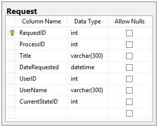

# Designing a Workflow Engine Database Part 3: Request Details and Data

Bây giờ chúng tôi đã xác định thông tin Process cơ bản của mình, vì vậy chúng tôi có thể bắt đầu giải quyết các bảng và mối quan hệ để biết chính xác Request bao gồm những gì.

## Các thành phần của một Request

Trong workflow engine của chúng tôi, một Request có các thành phần cơ bản sau:

- **Basic Info**: Tiêu đề, ngày tạo, người tạo và ID trạng thái hiện tại.
- **Data**: Một bộ dữ liệu có độ biến thiên cao liên quan đến một Request riêng lẻ.
- **Stakeholders**: Một nhóm Users sẽ nhận các bản cập nhật định kỳ về Request.
- **Files**: Bất kỳ tệp nào liên quan đến một Request riêng lẻ.
- **Notes**: Bất kỳ ghi chú nào do Users nhập liên quan đến một Request riêng lẻ.
- **Request Actions**: Các hành động có thể thực hiện vào bất kỳ thời điểm nào đối với một Request cụ thể.

Chúng ta sẽ giải quyết các Request Actions trong Phần 7 của loạt bài này. Bây giờ, hãy xác định những gì tạo nên một đối tượng Request, bắt đầu với bảng Request cơ bản.

## Thông tin cơ bản về Request

Các Request là duy nhất đối với các Process; một Request chỉ có thể tồn tại trong một Process duy nhất. Một Request cơ bản chỉ cần một phần thông tin từ User (tiêu đề) và phần thông tin cơ bản còn lại của Request đến từ cách Process được định hình. Bảng Request của chúng tôi sẽ như thế này:

- **Title**: Tiêu đề của Request.
- **CurrentStateID**: ID trạng thái hiện tại của Request.

## Request Data

Khi chúng tôi đã có thông tin cơ bản về Request, chúng tôi vẫn có một cách để lưu trữ dữ liệu không phù hợp với schema của bảng Request.

Rất có khả năng mỗi Process sẽ cần lưu trữ thông tin khác nhau về Request của chúng, vì vậy chúng tôi cần một thiết kế bảng đủ linh hoạt để cho phép nhiều loại dữ liệu. Tất cả những gì chúng ta thực sự biết về mỗi phần dữ liệu là nó sẽ có một giá trị và chúng ta cần một cách để xác định giá trị đó đại diện cho điều gì. Do đó, chúng tôi thiết kế bảng thành một tập hợp các cặp name-value và thiết kế của chúng tôi sẽ giống như sau:

Với Request và RequestData được xác định, thiết kế hoàn chỉnh của chúng ta (bao gồm **các bảng từ [Phần 2](./Part_2_The_Process_Table_And_Users.md)**) trông như thế này:

Chúng tôi vẫn cần ba bảng bổ sung để làm tròn những gì bao gồm một Request. Đầu tiên là Stakeholders.

## Stakeholders

**Stakeholders** là người sẽ nhận được cập nhật định kỳ về trạng thái của một Request nhất định. Về cơ bản, họ là những Users có liên quan đối với kết quả của Request. Điều này có nghĩa đơn giản là có mối quan hệ nhiều-nhiều giữa User và Request, vì vậy bảng đó trông như thế này:

## Notes and Files

Chúng tôi muốn cho phép Users thêm Notes vào Req để họ có thể ghi lại thông tin bổ sung không có trong Request Data hoặc States. Bảng Notes của chúng tôi trông như thế này:

Cuối cùng, chúng tôi muốn cho phép người dùng tải trực tiếp các Files có liên quan đến Request vào cơ sở dữ liệu này (một giải pháp mở rộng hơn có thể là lưu trữ tệp trên máy chủ tệp ở đâu đó, nhưng để đơn giản, chúng tôi sẽ lưu trữ tệp trong cơ sở dữ liệu cho thiết kế này). Chúng tôi cần lưu trữ tên tệp, loại MIME và nội dung thực của tệp trong bảng này. Bảng RequestFile trông như thế này:

## Chúng tôi đã hoàn thành những gì?

Sau khi triển khai thông tin Request, thiết kế hoàn chỉnh của chúng tôi trông như thế này:

Bằng cách hoàn thành các bảng Request, chúng tôi đã tạo ra hình thức cho dữ liệu thực sự sẽ đi qua các quy trình duyệt được xác định trong cơ sở dữ liệu này. Nhưng chính xác các quy trình duyệt này là gì, và chúng ta có thể định nghĩa chúng như thế nào?

Trong Phần 4 của loạt bài này, chúng ta sẽ bắt đầu thiết kế cách bản thân Process được cấu trúc như thế nào bằng cách thiết kế các bảng cho States và Transitions.

Happy Coding!
