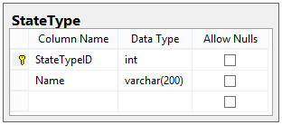
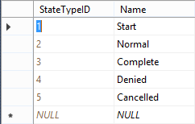
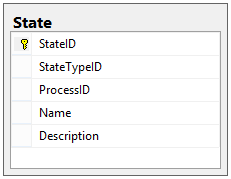
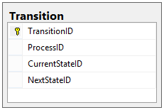
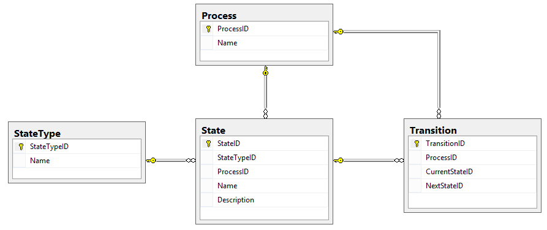

# Designing a Workflow Engine Database Part 4: States and Transitions

Bây giờ chúng ta đã tạo các bảng Process và Request, chúng ta có thể bắt đầu xây dựng các bảng cho chính Process thực sự.

Trong phần này, chúng tôi sẽ thiết kế các bảng chứa các States khác nhau mà một Request có thể có trong một Process và chúng tôi cũng sẽ thiết kế các bảng chỉ ra cách đi từ State này sang State khác (được gọi là Transitions). Tuy nhiên, trước tiên chúng ta cần một bảng chỉ ra những loại State khác nhau có thể tồn tại.

## State Types

**State Type** là một phân loại của các State riêng lẻ. Trong thiết kế của chúng tôi, đó là một danh sách không thể thay đổi, vì vậy trong code chúng tôi có thể sử dụng Enum để thể hiện nó. Vì chúng tôi đang làm cho thiết kế cơ sở dữ liệu này được chuẩn hóa hoàn toàn, nên chúng tôi sẽ bao gồm tập hợp dữ liệu này dưới dạng bảng, với cấu trúc sau:

Bởi vì chúng tôi không muốn có bất kỳ State Types nào do người dùng xác định, nên không có mối quan hệ nào với Process cho bảng này. Chúng tôi coi bảng này là không thể thay đổi và sẽ luôn có các giá trị sau:

Đây là lý do cho từng loại này:

- **Start**: Chỉ nên có một cho mỗi quy trình. Trạng thái này là trạng mà Request mới được thêm vào khi nó được tạo.
- **Normal**: Một trạng thái bình thường không có chỉ định đặc biệt.
- **Complete**: Trạng thái biểu thị rằng bất kỳ Request nào trong trạng thái này đã hoàn thành bình thường.
- **Denied**: Một trạng thái biểu thị rằng bất kỳ Request nào trong trạng thái này đã bị từ chối (ví dụ: không bao giờ bắt đầu và sẽ không được xử lý).
- **Cancelled**: Trạng thái biểu thị rằng bất kỳ Request nào trong trạng thái này đã bị hủy (ví dụ: công việc đã được bắt đầu nhưng không bao giờ hoàn thành).

Mỗi State phải thuộc một trong các State Types này. Nhưng điều gì tạo nên một State?

## States

**State** là một vị trí trong Process mà một Request nhất định có thể ở bất kỳ thời điểm nào. States là duy nhất đối với các Process và mỗi State có một tên, một mô tả và một loại. Bảng State của chúng ta trông như thế này:

Tuy nhiên, chúng ta nên nhớ rằng mỗi Process được cho là đại diện cho một flow chart và để làm được điều đó, chúng ta cần có khả năng di chuyển Request giữa các States. Chúng ta có thể làm như vậy bằng cách thiết kế các bảng cho Transitions.

## Transitions

Nếu lead dev chấp nhận một yêu cầu và bây giờ nó sẽ được chuyển đến nhóm Điều phối viên để nghiên cứu, làm cách nào chúng tôi có thể thiết kế dữ liệu của mình để thể hiện rằng việc di chuyển đó là có thể? Chúng tôi tạo ra một Transitions.

Một Transition là một đường dẫn giữa hai State cho biết cách Request có thể di chuyển giữa chúng. Transitions là duy nhất đối với Processes và do đó Transition bao gồm khóa chính, Process ID, trạng thái hiện tại và trạng thái tiếp theo:

## Chúng tôi đã hoàn thành những gì?

Thiết kế cơ sở dữ liệu hiện tại của chúng tôi (chỉ hiển thị các bảng States, Transitions, và Process) trông giống như sau:

Trong bài viết này, chúng tôi đã tạo hình dạng cho các thành phần cơ bản của Process bằng cách xác định các States mà một Request có thể tồn tại và các Transitions giữa những States đó.

Tuy nhiên, chúng tôi vẫn còn một vấn đề chưa giải quyết được: làm cách nào để gọi Transitions của chúng tôi? Làm cách nào để chúng tôi thực sự khiến Request chuyển từ State này sang State khác? Và điều gì sẽ xảy ra mỗi khi chúng ta đến một State mới (hoặc theo một Transition mới) cho một Request nhất định?

Tất cả những điều đó và hơn thế nữa trong bài đăng tiếp theo, Phần 5 của cuộc phiêu lưu này, thảo luận về Actions và Activities.

Happy Coding!
