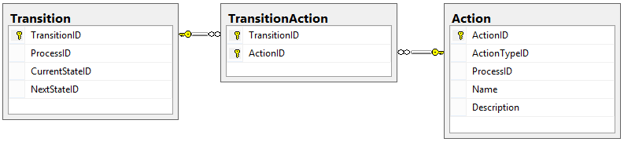

# Designing a Workflow Engine Database Part 5: Actions and Activities

Đã xác định Cơ sở hạ tầng của [Process](./Part_2_The_Process_Table_And_Users.md), [cấu trúc Request](./Part_3_Request_Details_And_Data.md), cũng như [States và Transitions](./Part_4_States_And_Transitions.md), giờ đây chúng tôi có thể bắt đầu thiết kế các bảng cho những gì User thực sự có thể thực hiện đối với Request trong hệ thống này. Đối với điều đó, chúng tôi sẽ xác định hai thuật ngữ:

- **Actions**: Những điều người dùng có thể thực hiện trên một Request.
- **Activities**: Những thứ phát sinh từ một Request chuyển đến một State cụ thể hoặc sau một Transition cụ thể.

Hãy bắt đầu bằng cách tạo Actions và Action Types.

## Actions

Hành động là những thứ user có thể thực hiện theo Request.

Giả sử chúng tôi nhận được yêu cầu xây dựng một cửa hàng tạp hóa mới và yêu cầu đó bao gồm địa chỉ của khu đất nơi cửa hàng đó sẽ được xây dựng. John, người chịu trách nhiệm phê duyệt việc xây dựng cửa hàng mới, đã xem xét yêu cầu và quyết định rằng xây dựng một cửa hàng ở đây là một ý tưởng hay. Anh ta Approval cho Request, điều này có thể khiến Request chuyển sang trạng thái tiếp theo. John đã thực hiện một Action.

Vì chúng tôi không muốn cho phép vô số loại hành động có thể được thực hiện, nên chúng tôi sẽ nhóm các Hành động lại với nhau thông qua một bảng ActionType giống như sau:

Cũng giống như bảng StateType, bảng này độc lập với Process và sẽ được coi là tĩnh. Đối với cơ sở dữ liệu của chúng tôi, chúng tôi sẽ sử dụng các Action Types sau:

Tại sao chúng tôi sử dụng các loại hành động này?

- **Approve**: Action này gợi ý rằng yêu cầu nên chuyển sang trạng thái tiếp theo.
- **Deny**: Action này gợi ý rằng yêu cầu nên chuyển sang trạng thái trước đó.
- **Cancel**: Action này gợi ý rằng yêu cầu nên chuyển sang trạng thái Cancelled trong quy trình.
- **Restart**: Action này gợi ý rằng yêu cầu được chuyển trở lại trạng thái Start trong quy trình.
- **Resolve**: Action này gợi ý rằng yêu cầu được chuyển hoàn toàn sang trạng thái Completed.

Lý do chúng tôi nói rằng người đó đang "gợi ý" rằng yêu cầu được di chuyển là vì **chúng tôi muốn** cho phép một quy trình yêu cầu nhiều Actions để gọi một Transition. Có thể một yêu cầu sẽ cần nhiều thứ xảy ra trước khi có thể tiếp tục trong quy trình và chúng tôi muốn cho phép trường hợp đó xảy ra.

Bây giờ chúng ta cần bảng cho chính các Actions. Actions là duy nhất đối với các Processes và mỗi quy trình có một ActionType, vì vậy bảng của chúng ta sẽ trông như thế này:

Thiết kế của chúng tôi cho ActionTypes và Actions trông như thế này:

### Transition Actions

Bây giờ chúng ta đã xác định những Actions nào có thể được thực hiện, chúng ta cần tìm hiểu cụ thể hơn: những Actions nào có thể được thực hiện cho một Transition cụ thể?

Mối quan hệ giữa Transition và Action là nhiều-nhiều:

## Activities

**Activities** là những điều có thể xảy ra do Request vào một State hoặc sau một Transition.

Ví dụ, hãy xem lại sơ đồ từ [Phần 1](./Part_1_Designing_a_Workflow_Engine_Database.md).

Ở Bước 3 của sơ đồ này, chúng tôi có thể muốn thêm Lead làm bên liên quan trong một yêu cầu để họ sẽ nhận được email tự động về trạng thái của yêu cầu đó. Tuy nhiên, nếu Lead từ chối yêu cầu, chúng tôi sẽ muốn thông báo cho Requester, nhưng nếu họ chấp thuận yêu cầu, chúng tôi cần thông báo cho Coordinators.

Nói cách khác, trong ví dụ này, việc thêm bên liên quan là hoạt động mà chúng tôi muốn xảy ra khi Request đạt đến một trạng thái nhất định và gửi email là hoạt động mà chúng tôi muốn xảy ra khi một quá trình chuyển đổi nhất định được thực hiện. Chúng ta cần thiết kế cho cả hai trường hợp.

Đầu tiên, chúng ta cần biết chúng ta có thể thực hiện những loại hành động nào. Bảng này giống như StateType và ActionType ở chỗ nó không phải là duy nhất đối với Process và có thể được coi là tĩnh. Đây là thiết kế cho bảng ActivityType:

Giống như ActionType, các giá trị cho ActivityType là tĩnh. Chúng tôi sẽ sử dụng các giá trị sau:

- **Add Note**: Chỉ định rằng chúng tôi sẽ tự động thêm ghi chú vào Request.
- **Send Email**: Chỉ định rằng chúng tôi nên gửi email đến một hoặc nhiều người nhận.
- **Add Stakeholders**: Chỉ định rằng chúng tôi nên thêm một hoặc nhiều người làm Stakeholders theo yêu cầu này.
- **Remove Stakeholders**: Chỉ định rằng chúng tôi nên xóa một hoặc nhiều Stakeholders khỏi yêu cầu này.

Bạn có thể định nghĩa thêm một vài loại ActivityTypes, nhưng bây giờ chúng ta sẽ chỉ sử dụng bốn loại đó.

Điều cuối cùng chúng ta cần làm là thiết kế bảng Activity, bảng này trông rất giống bảng Action:

### State and Transition Activities

Khi chúng tôi đã xác định bảng Activity cơ sở, chúng tôi có thể bắt đầu thiết kế cách Activities được liên kết với States và Transitions. Xin nhắc lại, chúng tôi muốn có thể bắt đầu Activities trong hai tình huống:

- Khi Request vào một State
- Khi Request theo sau một Transition

Điều này có nghĩa là chúng ta vẫn cần liên kết Activities với States và Transitions, như sau:

## Chúng tôi đã hoàn thành được những gì?

Sơ đồ cơ sở dữ liệu của chúng tôi (hiển thị Process, States, Transitions, Actions và Activities) trông giống như sau:

Trong bài đăng này, chúng tôi đã trình bày cách chúng tôi có thể lưu trữ những Actions nào mà Người dùng có thể thực hiện và những loại Activities nào có thể được bắt đầu bởi một số States hoặc Transitions nhất định. Về bản chất, chúng tôi đã chỉ ra những gì Users có thể làm đối với Requests và kết quả là điều gì sẽ xảy ra với Users.

Tuy nhiên, chúng tôi vẫn còn thiếu một phần của tất cả những điều này: chính xác thì ai thực sự có thể thực hiện các Actions hoặc nhận các Activities?

Chúng tôi sẽ trả lời câu hỏi đó trong bài đăng tiếp theo, Phần 6 của loạt bài này, nơi chúng tôi sẽ thảo luận về [Groups và Targets](./Part_6_Groups_And_Targets.md).

Happy Coding!
