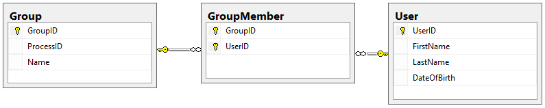

# Designing a Workflow Engine Database Part 6: Groups and Targets

Bây giờ chúng ta đã xác định được hầu hết các bảng Processes, nhưng chúng ta vẫn còn thiếu một số thứ.

Một trong những điều đó là định nghĩa chính xác ai có thể thực hiện Actions hoặc nhận Activities; chúng tôi sẽ gọi đây là **Targets**.

Phần thứ hai chúng ta cần là **Groups** hoặc tập hợp những người thực hiện một công việc tương tự hoặc có liên quan trong quy trình này. Trong thiết kế của chúng tôi, chúng tôi muốn cho phép Group cũng là Target. Hãy xem làm thế nào chúng ta có thể thiết kế những bảng này!

## Groups

Groups là tập hợp Users thực hiện các chức năng liên quan.

Ví dụ: chúng tôi có thể có một nhóm được gọi là Programmers thực hiện việc viết code hoặc một nhóm được gọi là Executives phê duyệt các dự án để phát triển. Bởi vì chúng tôi đang xây dựng một Workflow Engine chung, nên chúng tôi muốn đảm bảo rằng mỗi Process có thể có các Groups riêng.

Bảng Group khá đơn giản:

Chúng tôi cũng cần một bảng để biểu thị những Users nào trong một nhóm nhất định, đây sẽ là một bảng nhiều-nhiều khác. Bảng này được gọi là GroupMember:

## Targets

Hãy nhớ rằng hệ thống này tập trung vào con người; chỉ người mới có thể thực hiện Request. Chúng tôi vẫn cần một cách để liên kết những người (hoặc Groups) nào có thể thực hiện Actions và nhận Activities.

Vấn đề là chúng tôi có thể cần chỉ định rằng chỉ Requester của một Request nhất định mới có thể gửi yêu cầu đó tới người giám sát của họ hoặc tất cả những người này cần nhận được email khi Request đạt đến một State nhất định. Làm cách nào chúng ta có thể thiết kế điều này theo cách linh hoạt trong việc ai có thể thực hiện Action hoặc nhận Activity, nhưng vẫn thực hiện một số quy tắc mà hệ thống phải tuân theo?

Chúng tôi có thể thực hiện điều này bằng cách tạo Targets. Một Target là một tập hợp các biểu diễn tiêu chuẩn của một người có các vai trò cụ thể liên quan đến một Request hoặc Process. Chúng tôi sử dụng các mục tiêu sau:

- Người tạo Request (Requester)
- Request Stakeholders
- Group Members
- Process Admins

Bảng Target của chúng tôi trông như thế này:

Bởi vì đây là một bảng tĩnh khác (như StateType, ActionType và ActivityType), nên chúng tôi không mong đợi dữ liệu trong đó sẽ thay đổi. Đây là dữ liệu chúng tôi sẽ sử dụng cho thiết kế này:

## Action Targets và Activity Targets

Bảng Mục tiêu không giúp ích gì cho chúng ta trừ khi chúng ta có thể liên kết nó với các bảng khác thực sự có thể sử dụng Targets. Chúng tôi muốn sử dụng Targets trong hai trường hợp:

- Là những người có thể thực hiện Actions
- Là những người có thể nhận Activities

Trước tiên hãy thiết kế Action Targets. Đối với mọi Action có thể được gửi tới hệ thống này, chúng tôi cần xác định ai thực sự có thể gửi hành động đó để nó được coi là hợp lệ. Sau tất cả, chúng tôi không muốn người gác cổng Kevin chấp thuận việc xây dựng một cửa hàng tạp hóa mới, vì đó không phải là trách nhiệm của anh ấy. Với suy nghĩ này, thiết kế bảng của chúng ta trông như thế này:

Chúng tôi cần bao gồm Group ID vì nếu Target của chúng tôi là Group, chúng tôi phải chỉ định Group nào có thể thực hiện Action.

Bây giờ hãy thảo luận về Activity Targets. Tùy thuộc vào loại hoạt động, Targets cho hoạt động đó có thể nhận được email hoặc được thêm vào danh sách các bên liên quan cho Request, v.v. Bởi vì chúng tôi đã xác định một danh sách Targets trung tâm, bảng ActivityTarget trông rất giống với bảng ActionTarget:

**LƯU Ý QUAN TRỌNG**: Khi sử dụng Group làm Target, cách hệ thống diễn giải mối quan hệ này sẽ khác.

- Nếu Group là Action Target, thì _bất kỳ_ thành viên nào của Group đều có thể thực hiện hành động để nó hợp lệ.
- Nếu Group là Activity Target, thì _tất cả_ các thành viên của Group đều nhận được Activity (ví dụ: mọi người trong nhóm đều nhận được email).

## Chúng tôi đã hoàn thành được những gì?

Thiết kế của chúng tôi cho Actions, Activities, Groups và Targets giờ trông như thế này:

Trong phần này, chúng tôi đã xác định chính xác những người có thể thực hiện Actions và nhận Activities bằng cách tạo Targets và chúng tôi đã giúp công cụ của mình linh hoạt hơn một chút bằng cách tạo Groups Users mà mỗi người có thể làm điều tương tự như những người khác.

Trong phần tiếp theo của loạt bài này, chúng ta sẽ tìm hiểu phần cốt lõi thực sự của hệ thống. Chúng tôi sẽ chỉ ra cách các Requests riêng lẻ có thể theo dõi những Actions nào có thể được thực hiện đối với chúng và chúng tôi sẽ xem cách chúng tôi có thể sử dụng danh sách đó để xác định Transition nào mà Request cần tuân theo. Tiếp theo là Phần 7 của loạt bài này, Request Actions.

Happy Coding!
