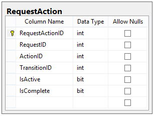

# Designing a Workflow Engine Database Part 7: Request Actions

Tất cả cơ sở hạ tầng chúng tôi đã xây dựng cho đến nay đều dẫn đến thời điểm này. Cuối cùng, chúng tôi có thể xây dựng phần cuối cùng của lược đồ: bảng Request Actions.

## Request Actions

Bây giờ chúng tôi có các Actions mà Users có thể thực hiện để gọi Transitions. Rõ ràng là chúng tôi không thể cho phép bất kỳ hành động nào được thực hiện đối với Request; chỉ những hành động chúng tôi cần mới được cho phép.

### The Table

Trước tiên, hãy xem schema của bảng RequestActions, sau đó chỉ ra cách nó thực sự được sử dụng:

Hai cột cuối cùng (IsActive và IsComplete) rất quan trọng đối với việc thực thi thực tế của bảng này.

Đây là cách chúng tôi sẽ sử dụng bảng này.

1. Khi một Request vào một State, chúng tôi sẽ nhận được tất cả các Transitions từ trạng thái đó. Đối với mỗi Action trong các Transitions đó, chúng tôi thêm một mục trong RequestAction, với mỗi mục có IsActive = 1 và IsCompleted = 0.
2. User có thể gửi một Action bất cứ lúc nào. Mỗi Action được gửi bao gồm một ActionType, một RequestID và một UserID.
3. Khi một Action được gửi, chúng tôi sẽ kiểm tra RequestActions cho Request đã chỉ định. Nếu Action đã gửi khớp với một trong các RequestActions đang hoạt động (trong đó IsActive = 1), thì chúng tôi đặt IsActive = 0 và IsCompleted = 1 của mục đó.
4. Sau khi đánh dấu Action đã gửi là hoàn thành, chúng tôi kiểm tra tất cả các Actions cho Transition đó trong Request đó. Nếu tất cả RequestActions được đánh dấu là Completed, thì chúng tôi sẽ vô hiệu hóa tất cả các hành động còn lại (bằng cách đặt IsActive = 0, ví dụ: tất cả các hành động cho Transitions không khớp).

### Mẫu hướng dẫn

Hãy xem liệu chúng tôi có thể thấy điều này hoạt động như thế nào bằng cách giới thiệu một số dữ liệu mẫu.

- **USERS**: Jane (ID 1), Tom (ID 2), Gary (ID 3)
- **GROUPS**: Executives (ID 1), bao gồm Tom và Gary
- **STATES**: A (Type: Start), B (Type: Normal), C (Type: Denied)
- **TRANSITIONS**: A -> B (ID 1), A -> C (ID 2), B -> C (ID 3)
- **TRANSITION ACTIONS**:
  - A -> B: Approved bởi Requester (ID 1) và Approved bởi Executives (ID 2)
  - A -> C: Denied bởi Executives (ID 3)
  - B -> C: Denied bởi Requester (ID 4)

Giả sử Jane tạo một Request, yêu cầu này ngay lập tức được đưa vào State A.

Tại thời điểm này, hệ thống tìm kiếm tất cả các chuyển đổi đi từ State A và tìm thấy hai trong số chúng, Transitions 1 và 2. Sau đó, hệ thống sẽ tải dữ liệu sau vào RequestActions:

| RequestID | ActionID | TransitionID | IsActive | IsComplete |
| :-------: | :------: | :----------: | :------: | :--------: |
|     1     |    1     |      1       |   YES    |     NO     |
|     1     |    2     |      1       |   YES    |     NO     |
|     1     |    3     |      2       |   YES    |     NO     |

Bây giờ, Request chỉ ở trạng thái hiện tại, chờ Action được gửi.

Giả sử Jane gửi hành động này:

ACTION:
User ID: 1
ActionType: Approve
Request ID: 1
(Chúng tôi đọc là "User 1 phê duyệt Request 1")

Vì hành động đó khớp với RequestAction đầu tiên trong bảng nên nó được đánh dấu là đã hoàn thành:

| RequestID | ActionID | TransitionID | IsActive | IsComplete |
| :-------: | :------: | :----------: | :------: | :--------: |
|     1     |    1     |      1       |  **NO**  |  **YES**   |
|     1     |    2     |      1       |   YES    |     NO     |
|     1     |    3     |      2       |   YES    |     NO     |

Tại thời điểm này, chúng tôi chưa khớp tất cả các Actions cho Transition, vì vậy không có gì xảy ra với Request; nó vẫn ở State A.

Bây giờ giả sử Tom gửi hành động này:

ACTION:
User ID: 2
ActionType: Approve
Request ID: 1
(User 2 phê duyệt Request 1)

Sau khi hành động đó được khớp, bảng Request Actions bây giờ trông giống như sau:

| RequestID | ActionID | TransitionID | IsActive | IsComplete |
| :-------: | :------: | :----------: | :------: | :--------: |
|     1     |    1     |      1       |    NO    |    YES     |
|     1     |    2     |      1       |  **NO**  |  **YES**   |
|     1     |    3     |      2       |   YES    |     NO     |

Lưu ý rằng vì cả hai Actions cho Transition 1 đã hoàn tất, bây giờ chúng tôi phải thực hiện theo Transition 1 và chuyển Request sang State tiếp theo, đó là State B. Sau khi chúng tôi chuyển sang State B, chúng tôi tải các Actions cho Transitions từ State đó và vô hiệu hóa mọi Actions cũ; bảng RequestActions của chúng tôi trông như thế này:

| RequestID | ActionID | TransitionID | IsActive | IsComplete |
| :-------: | :------: | :----------: | :------: | :--------: |
|     1     |    1     |      1       |    NO    |    YES     |
|     1     |    2     |      1       |    NO    |    YES     |
|     1     |    3     |      2       |  **NO**  |     NO     |
|     1     |    4     |      3       |   YES    |     NO     |

Theo cách này, chúng tôi có thể theo dõi tất cả các hành động đã được thực hiện, có thể đã được thực hiện và vẫn đang chờ được thực hiện trong cùng một bảng.

## Chúng tôi đã hoàn thành được những gì?

Trong bài đăng này, chúng tôi đã triển khai phần cuối cùng trong cấu trúc của mình: bảng Request Actions. Bảng này lưu trữ tất cả các Actions có thể được thực hiện đối với một Request cụ thể và là cách thức hệ thống này thực sự hoạt động.

Vẫn còn một phần cuối cùng mà chúng tôi sẽ nói đến và đó thực sự là xây dựng và trình diễn một quy trình chạy trên hệ thống này.

Phần cuối cùng của câu chuyện của chúng tôi là Phần 8, nơi chúng tôi sẽ thảo luận về schema hoàn chỉnh và những thiếu sót trong thiết kế cơ sở dữ liệu Workflow Engine của chúng tôi.

Happy Coding!
