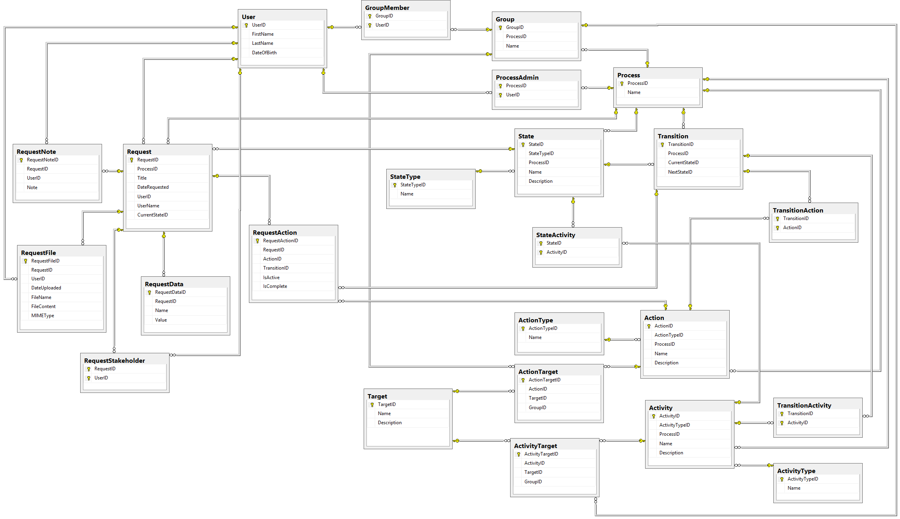

# Designing a Workflow Engine Database Part 8: Complete Schema and Shortcomings

Bây giờ chúng tôi đã hoàn thành thiết kế cơ sở dữ liệu cho Workflow Engine của chúng tôi, vì vậy hãy xem sơ đồ cơ sở dữ liệu cuối cùng ([bấm vào đây để xem lớn hơn](https://exceptionnotfound.net/content/images/2015/04/workflowengine-design.png)):

Có rất nhiều bảng! Nhưng chúng tôi đang cố gắng thiết kế một công cụ chung, một công cụ có thể được sử dụng cho nhiều quy trình khác nhau và do đó, độ phức tạp của thiết kế này phản ánh mức độ phức tạp của các yêu cầu.

## Những thiếu sót của thiết kế này

Có một vài thiếu sót của thiết kế này:

- Hiện tại, không có cách nào để nói "Ở trạng thái này trong X ngày; sau X ngày, hãy chuyển sang trạng thái khác". Chúng tôi không thể khiến Requests di chuyển trong Process trong khoảng thời gian đã cho.

- Chúng tôi không có sẵn quy trình để xử lý một State hoặc Transition không còn tồn tại (có nghĩa là mặc dù Process Admins được cho là có thể tự thay đổi Process, nhưng điều gì sẽ xảy ra khi họ thực sự làm điều đó?)

- Bảng RequestFiles lưu trữ các tệp thực trong chính bảng đó; một cách hiệu quả hơn để làm điều này là lưu trữ các tệp trên kho tệp ở đâu đó và chỉ giữ các tham chiếu đến chúng trong bảng này.

- Chúng tôi hiện không có cách nào để chỉ định rằng một cá nhân cụ thể cần thực hiện một Action hoặc nhận một Activity.

Điều đó nói rằng, hầu hết những thiếu sót này là khá dễ dàng để thực hiện; chúng tôi thực sự đã giải quyết một vài trong số chúng cho Workflow Engine của công ty chúng tôi.

Hãy nhớ rằng: **đây chỉ là một database schema**. Thiết kế không tính đến cách dịch vụ này thực sự sẽ được triển khai trong code.

Chà! Đó là rất nhiều bước! Nhưng những gì chúng tôi đã đạt được là một thiết kế Workflow Engine database **chung**, **có thể mở rộng**, **có thể tái sử dụng**, có thể xử lý rất nhiều quy trình.

Happy Coding!
