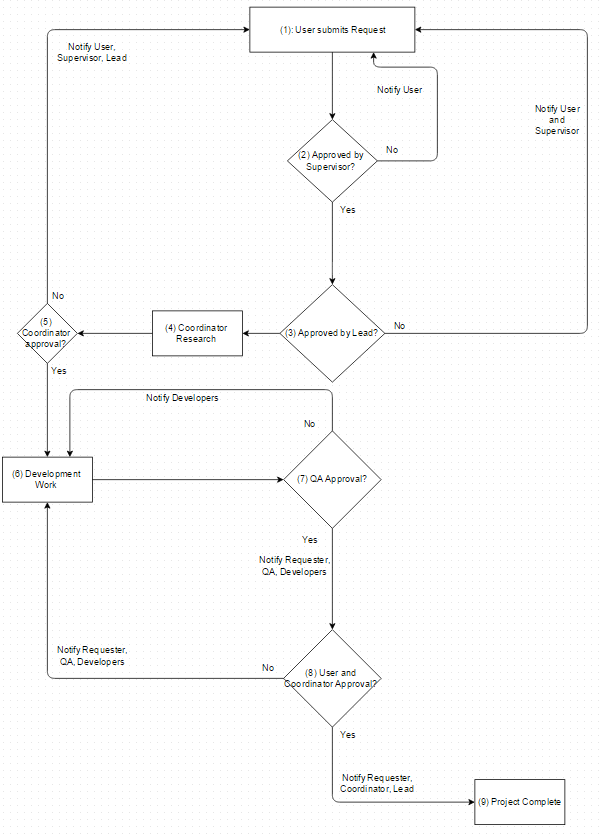

# Designing a Workflow Engine Database

Công ty chúng tôi nhận thấy rằng rất nhiều quy trình nội bộ của chúng tôi tương đối giống nhau: một người yêu cầu điều gì đó (ví dụ: mua hàng, phê duyệt để bắt đầu xây dựng thứ gì đó, v.v.), sau đó một loạt người chấp thuận yêu cầu đó cho đến khi điều đó đã được xem xét và phê duyệt bởi bất kỳ ai cần xem xét nó.

Nhóm của chúng tôi (đặc biệt là nhóm quản lý của chúng tôi, những người gần như phải xử lý các ứng dụng rất giống nhau này hàng ngày) bắt đầu nghĩ rằng vì chúng tôi có quá nhiều quy trình phê duyệt tương tự nhau, liệu chúng tôi có thể xây dựng một công cụ dựa trên cơ sở dữ liệu để quản lý tất cả chúng không?

Tôi được giao nhiệm vụ điều tra những điểm tương đồng này và trong quá trình thực hiện, tôi nhận ra rằng các quy trình này về cơ bản là các máy có trạng thái hữu hạn có Request ở một State nhất định tại bất kỳ thời điểm cụ thể nào và điều này cũng xác định cách chuyển từ state này sang state khác (Transitions) và cần gì để thực hiện điều đó (Actions).

## Workflow là gì?

Workflow là một loạt cách quyết định được đưa ra bởi những người khác nhau nhằm xác định điều gì sẽ xảy ra với một yêu cầu cụ thể mà một trong số những người đó đã đưa ra, theo một quy trình được xác định và có thể lặp lại. Một ví dụ về quá trình này được hiển thị trong flowchart này:

## Ví dụ các bước trong Workflow

Hãy giải thích flow chart đó theo cách khác, bằng cách liệt kê từng bước:

1. John Doe gửi một yêu cầu có nội dung "Tôi cần một trang web cho phép tôi yêu cầu nhân viên của mình log lại thời gian nghỉ phép để tôi có thể nhanh chóng xem xét."
2. John gửi yêu cầu đó cho quản lý của anh ấy Victoria, người cũng đồng ý với anh ấy và chấp thuận yêu cầu này.
3. Sự chấp thuận của Victoria gửi yêu cầu này đến Nate, lead developer, người xem xét yêu cầu ban đầu và quyết định rằng có một ý tưởng khả thi ở đây mà anh ấy và nhóm của mình có thể triển khai làm trang web.
4. Sự chấp thuận của Nate gửi yêu cầu này đến Jenna, điều phối viên, người bắt đầu tiến hành nghiên cứu (có thể có sự tham gia của John, Victoria và Nate) để xác định yêu cầu này tốn bao nhiêu thời gian, công sức.
5. Nếu Jenna chấp thuận yêu cầu này, nó được giao ngược lại cho Nate để bắt đầu phát triển.
6. Nate và nhóm của anh ấy bắt đầu công việc phát triển. Bước này có thể mất một lượng thời gian nhất định.
7. Sau khi hoàn thành công việc phát triển, yêu cầu sẽ được gửi tới team QA để phê duyệt, dẫn đầu bởi Charles.
8. Nếu Charles và team của anh ấy không tìm thấy bất kỳ vấn đề nào, anh ấy sẽ chấp thuận dự án này và gửi nó đến John để chấp thuận lần cuối cùng (về cơ bản, tất cả các team đều sẽ hỏi John, "đây là thứ bạn muốn phải không").
9. Nếu John chấp thuận dự án này, nó sẽ được đánh dấu là hoàn thành và sẽ không có bất kỳ hành động nào được thực hiện tiếp.

## Rất nhiều điểm tương đồng

Chúng tôi có nhiều loại workflow trong tổ chức của mình và nhóm quản lý muốn các lập trình viên chúng tôi xác định xem chúng tôi có thể xây dựng một dịch vụ chung, dựa trên cơ sở dữ liệu có thể đại diện cho nhiều (nếu không phải tất cả) các quy trình này trong một cơ sở dữ liệu trung tâm hay không.

Sau khi xem xét một số quy trình công việc hiện có, nhóm của tôi và tôi phát hiện ra rằng tất cả chúng đều có các thành phần tương tự nhau:

- Một **đối tượng Request** được nhiều người xem xét, phê duyệt hoặc triển khai.
- Một **tập hợp dữ liệu có độ biến thiên cao** được liên kết với từng Request.
- Một **loạt các quyết định (được gọi là Process)** xác định ai sẽ là người tiếp theo xem xét Request. Các quyết định luôn phải được một cá nhân nào đó đưa lên hệ thống (engine), nhưng người đó có thể liên quan đến Request (ví dụ như Người yêu cầu hoặc các bên liên quan) hoặc là một trong nhóm các cá nhân.
- Một **tập hợp các thông báo** có thể gửi đến nhiều nhóm người khác nhau.
- Một số ít người được giao **trách nhiệm quản lý quy trình chính**.

## Thiết kế một database cho hệ thống Workflow

Trong loạt bài này, chúng ta sẽ xem qua thiết kế cơ sở dữ liệu của ứng dụng Workflow và hiển thị từng phần của giải pháp đã được triển khai và cuối cùng là cách tất cả chúng được kết nối với nhau. Chúng tôi sẽ làm điều này trong tám phần (bài đăng này là Phần 1):

- Phần 2: [The Process Table and Users](./Part_2_The_Process_Table_And_Users.md)
- Phần 3: [Request Details and Data](./Part_3_Request_Details_And_Data.md)
- Phần 4: [States and Transitions](./Part_4_States_And_Transitions.md)
- Phần 5: [Actions and Activities](./Part_5_Actions_And_Activities.md)
- Phần 6: [Groups and Targets](./Part_6_Groups_And_Targets.md)
- Phần 7: Request Actions
- Phần 8: Complete Schema and Shortcomings

Đây không phải là thiết kế duy nhất có thể triển khai Workflow và nó đã được đơn giản hóa từ thiết kế được triển khai thực tế của chúng tôi. Nhưng tôi tin rằng việc đưa các ý tưởng thiết kế của mình ra giấy (có thể hiểu như vậy) sẽ giúp cả tôi hiểu rõ hơn về thiết kế của mình và hy vọng rằng bất kỳ DBA mới chớm nở nào khác ngoài đó khi họ đang cố gắng thiết kế cơ sở dữ liệu cho các vấn đề không tầm thường của riêng họ.

**LƯU Ý QUAN TRỌNG**: _Tôi không phải là DBA và thiết kế này chưa được xem xét kỹ lưỡng bởi một người nào đó._

Một lưu ý cuối cùng: Trong loạt bài này, chúng tôi chỉ quan tâm đến việc trình bày cách thiết kế công cụ này chứ không thực sự triển khai nó bằng code. Điều này có nghĩa là chúng tôi sẽ không đề cập đến một số chi tiết nhất định, chẳng hạn như:

- Users được thêm vào cơ sở dữ liệu của chúng ta như thế nào?
- Làm thế nào Email thực sự được gửi đến người nhận.

Với những lưu ý đó, hãy cùng tôi khám phá cách thiết kế cơ sở dữ liệu Workflow Engine, bắt đầu với Process Table và Users!

Happy Coding!
